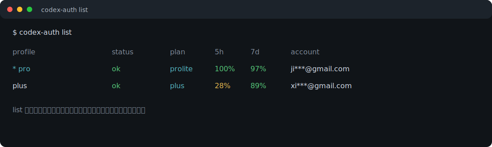
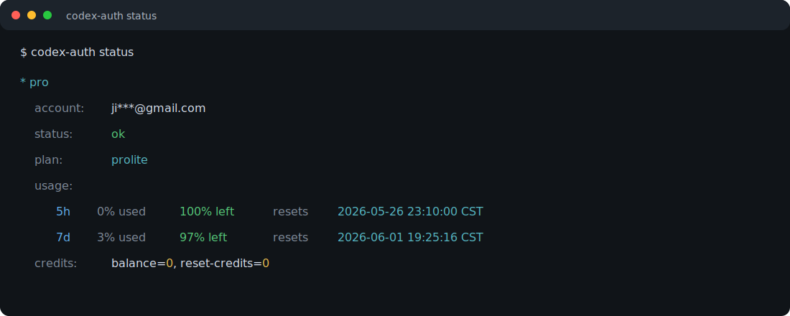
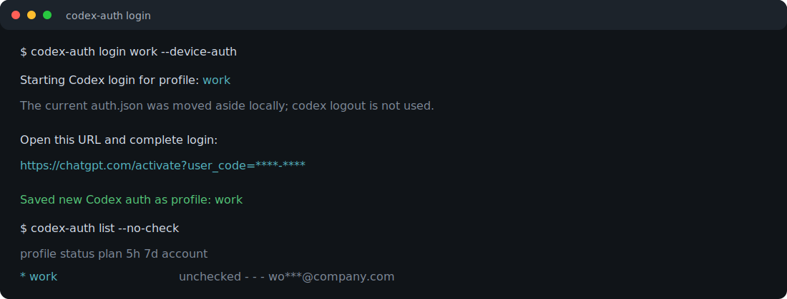

# codex-auth

[中文](README.md) | English

`codex-auth` is a local profile switcher for Codex CLI authentication.

It keeps one shared Codex home, config, session history, skills, and plugins, while
allowing multiple saved `auth.json` profiles. Switching accounts only replaces the
local `~/.codex/auth.json`; it does not run `codex logout`, so it does not actively
revoke the previous account.

## Screenshots

The screenshots below use masked sample accounts. No real token, account id, or
full email address is shown.

### Account List



### Current Account Status



### Login New Account



## Features

- Save the current Codex login as a named profile.
- Switch between profiles by replacing the local `auth.json`.
- Add a new account without calling `codex logout`.
- Show concise account summaries with profile, status, plan, and 5h/7d remaining quota.
- Show detailed current-account status, including reset time and credits.
- Colorize terminal output by status and remaining quota.
- Keep the executable wrapper small; implementation is split into Python modules.

## Install

Use the installer for normal setups. It installs the project into
`~/.local/share/codex-auth` and registers `~/.local/bin/codex-auth`.

### One-Line Install

Run:

```bash
curl -fsSL https://raw.githubusercontent.com/jinzita-lx/codex-auth/v0.1.2/install.sh | bash
```

### Verify

After installation, run:

```bash
codex-auth --help
codex-auth path
```

`codex-auth path` should print the active `CODEX_HOME`, `auth.json`, and profile
directory.

If `codex-auth` is not found, add `~/.local/bin` to `PATH`:

```bash
export PATH="$HOME/.local/bin:$PATH"
```

### Requirements

- macOS or Linux shell
- Python 3.9+
- Codex CLI available as `codex`
- `~/.local/bin` on `PATH`

### Install Paths

The default installation uses:

```text
~/.local/share/codex-auth/     # project code
~/.local/bin/codex-auth        # executable wrapper on PATH
~/.codex/auth-profiles/        # saved auth profiles
~/.codex/auth.json             # active Codex auth file
```

To pin the version or install location:

```bash
curl -fsSL https://raw.githubusercontent.com/jinzita-lx/codex-auth/v0.1.2/install.sh | CODEX_AUTH_REF=v0.1.2 CODEX_AUTH_PREFIX="$HOME/.local" bash
```

## Quick Start

Save the account currently logged in through Codex:

```bash
codex-auth save personal
```

Login another account without logging out the current one:

```bash
codex-auth login work
```

Switch accounts:

```bash
codex-auth switch personal
codex-auth switch work
```

List saved profiles:

```bash
codex-auth list
```

Show detailed current-account status:

```bash
codex-auth status
codex-auth status work
```

## Commands

### `codex-auth login <name> [--replace] [codex-login-options...]`

Login a new Codex account and save it as `<name>`.

This command does not call `codex logout`. Instead it:

1. Saves the current active profile if it is safe to do so.
2. Moves the current `auth.json` aside locally.
3. Runs `codex login`.
4. Saves the new `auth.json` as `auth-profiles/<name>.json`.
5. Marks `<name>` as active.

If login fails, the previous `auth.json` is restored.

Examples:

```bash
codex-auth login work
codex-auth login work --replace
codex-auth login work --device-auth
```

### `codex-auth save <name>`

Save the current `~/.codex/auth.json` as a named profile.

```bash
codex-auth save personal
```

### `codex-auth switch <name>`

Switch active Codex auth to a saved profile.

```bash
codex-auth switch work
```

### `codex-auth list [--no-check]`

Show a concise profile list.

```text
profile            status    plan    5h    7d    account
* pro              ok        prolite 100%  97%   ji***@gmail.com
  plus             ok        plus    28%   89%   xi***@gmail.com
```

By default, `list` checks account usability and quota online. Use `--no-check`
for a fast local-only view:

```bash
codex-auth list --no-check
```

### `codex-auth status [name]`

Show detailed status for the active profile or a named profile.

```text
* pro
  account: ji***@gmail.com
  status:  ok
  plan:    prolite
  usage:
    5h    0% used  100% left  resets 2026-05-26 23:10:00 CST
    7d    3% used   97% left  resets 2026-06-01 19:25:16 CST
  credits: balance=0, reset-credits=0
```

Examples:

```bash
codex-auth status
codex-auth status work
```

### `codex-auth check [name|--all]`

Check one profile in detail, or all profiles in concise list format.

```bash
codex-auth check work
codex-auth check --all
```

### `codex-auth rename <old> <new>`

Rename a saved profile.

```bash
codex-auth rename personal private
```

### `codex-auth remove <name>`

Delete a saved profile.

```bash
codex-auth remove private
```

### `codex-auth path`

Print the paths used by this installation.

```bash
codex-auth path
```

## Status Values

| Status | Meaning |
| --- | --- |
| `ok` | Auth works and the account is not currently limited. |
| `limited` | Auth works, but Codex usage is currently limited. |
| `unusable` | Token/key is rejected or revoked. |
| `missing` | The profile does not contain a usable token/key. |
| `error` | Network or service check failed. |
| `unchecked` | Local-only listing; no online check was run. |

## Usage Windows

Codex currently exposes two usage windows:

- `5h`: short rolling quota window.
- `7d`: weekly rolling quota window.

`list` shows remaining quota. `status` shows used quota, remaining quota, and
reset time for both windows.

## Color

Color is enabled automatically for interactive terminals and disabled for pipes
or redirected output.

```bash
CODEX_AUTH_COLOR=auto
CODEX_AUTH_COLOR=always
CODEX_AUTH_COLOR=never
NO_COLOR=1 codex-auth status
```

Color mapping:

- Green: usable status or healthy remaining quota.
- Yellow: limited/unknown status or medium remaining quota.
- Red: unusable/error/missing status or low remaining quota.
- Dim: labels, unchecked values, and used percentage.

## Safety Notes

- `codex-auth switch` only swaps the local `auth.json`.
- `codex-auth login` intentionally avoids `codex logout`.
- `codex logout` may revoke the current token; avoid using it for profile switching.
- Profiles are stored under `~/.codex/auth-profiles/` with mode `0600`.
- The online usage check sends the saved access token in an Authorization header
  directly from Python; tokens are not passed as command-line arguments.
- Before autosaving over an active profile, `codex-auth` compares account identity
  and skips the write if the current `auth.json` belongs to a different account.

## Project Structure

```text
codex-auth/
├── README.md
├── README.en.md
├── bin/
│   └── codex-auth
├── codex_auth/
│   ├── __main__.py
│   ├── cli.py
│   ├── colors.py
│   ├── store.py
│   ├── ui.py
│   ├── usage.py
│   └── utils.py
├── docs/
│   └── assets/
│       ├── list-summary.svg
│       ├── login-flow.svg
│       └── status-detail.svg
└── pyproject.toml
```

Module responsibilities:

- `cli.py`: command parsing and command dispatch.
- `store.py`: profile storage, lock handling, login, save, switch, rename, remove.
- `usage.py`: online account usability and quota checks.
- `ui.py`: terminal rendering.
- `colors.py`: terminal color policy.
- `utils.py`: JSON, JWT payload parsing, identity extraction, time formatting.

## Development

Install the current checkout locally:

```bash
./install.sh
```

Syntax and import check:

```bash
python3 -m compileall -q ~/.local/share/codex-auth/codex_auth
```

Run from the project without installing:

```bash
CODEX_AUTH_PROJECT=~/.local/share/codex-auth ~/.local/share/codex-auth/bin/codex-auth --help
```

Use a temporary Codex home for tests:

```bash
tmp="$(mktemp -d)"
CODEX_HOME="$tmp" codex-auth path
```
